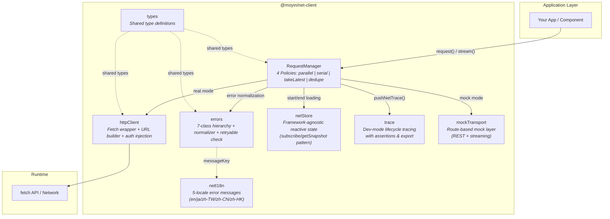

<p align="center">
  <strong>@moyin/net-client</strong><br/>
  Framework-agnostic TypeScript HTTP client with request deduplication, concurrency policies, retry strategies, and streaming
</p>

<p align="center">
  <a href="https://github.com/AtsushiHarimoto/Moyin-Factory"></a>
  
  
  
  
</p>

<p align="center">
  English | <a href="docs/README.ja.md">日本語</a> | <a href="docs/README.zh-TW.md">繁體中文</a>
</p>

---

## Why This Library?

Most HTTP clients handle the "happy path" well. Real-world applications, however, face:

- **Duplicate requests** fired by rapid user interactions (double-clicks, search-as-you-type)
- **Stale responses** arriving after a newer request has already completed
- **Flaky networks** requiring intelligent retry with exponential backoff
- **Loading state sprawl** scattered across components instead of centralized

`@moyin/net-client` solves all of these at the transport layer with **four concurrency policies**, a **structured error hierarchy**, and a **framework-agnostic reactive store** -- so your UI layer stays clean.

---

## Architecture



### Module Responsibilities

| Module | Lines | Responsibility |
|--------|------:|----------------|
| `requestManager.ts` | 611 | Core orchestrator -- inflight tracking, 4 concurrency policies, retry loop, streaming, cancellation |
| `httpClient.ts` | 198 | Fetch wrapper with timeout, URL resolution, auth token injection, convenience methods (`get`/`post`/`put`/`patch`/`del`) |
| `errors.ts` | 179 | 7 typed error classes (`NetHttpError`, `NetTimeoutError`, `NetOfflineError`, `NetCanceledError`, `NetStaleDiscardedError`, `NetLateDiscardedError`, `NetUnknownError`) + normalizer + retryability check |
| `netStore.ts` | 154 | Framework-agnostic reactive store using `subscribe`/`getSnapshot` pattern (compatible with React `useSyncExternalStore` and Vue `watchEffect`). Tracks global/scoped loading, offline status, network flakiness |
| `trace.ts` | 130 | Dev-mode request lifecycle tracing with ring buffer, summary export, and assertion checks |
| `netI18n.ts` | 77 | Localized error messages for 5 locales |
| `mockTransport.ts` | 82 | Route-based mock transport for both REST and streaming, enabling full offline development |
| `types.ts` | 226 | Shared type definitions for the entire module system |

---

## Key Technical Decisions

### 1. Four Concurrency Policies

Every request declares a `policy` that governs how concurrent requests with the same `requestKey` behave:

| Policy | Behavior | Use Case |
|--------|----------|----------|
| `parallel` | All requests execute independently | Batch operations, independent resources |
| `takeLatest` | New request auto-cancels the previous one | Search-as-you-type, filter changes |
| `dedupe` | Subsequent calls share the existing in-flight promise | Component mounts, cache warming |
| `serial` | Requests queue and execute one-at-a-time | Ordered mutations, form submissions |

```typescript
// Search-as-you-type: only the latest keystroke's request survives
const { promise } = manager.request({
  method: 'GET',
  url: '/search',
  params: { q: query },
  policy: 'takeLatest',
  requestKey: 'search-main',
})
```

### 2. Exponential Backoff Retry

Configurable retry with exponential backoff, targeting specific HTTP status codes:

```typescript
const { promise } = manager.request({
  method: 'POST',
  url: '/api/submit',
  data: payload,
  retry: {
    maxRetries: 3,
    baseDelayMs: 300,
    backoffFactor: 2,          // 300ms -> 600ms -> 1200ms
    retryOnStatuses: [429, 500, 502, 503, 504],
  },
})
```

Retry respects cancellation -- if a request is cancelled during a backoff sleep, it exits immediately without wasting resources.

### 3. Structured Error Hierarchy

Every error is a typed `NetError` subclass with semantic properties:

```
NetError (base)
  ├── NetHttpError        { httpStatus: number }
  ├── NetTimeoutError     { isTimeout: true }
  ├── NetOfflineError     { isOffline: true }
  ├── NetCanceledError    { isCanceled: true, cancelReason }
  ├── NetStaleDiscardedError  { isStale: true }
  ├── NetLateDiscardedError
  └── NetUnknownError
```

The `normalizeToNetError()` function catches raw exceptions (DOMException AbortError, TypeError from fetch failures) and converts them into the typed hierarchy -- so your error handling is always consistent.

### 4. Framework-Agnostic Reactive Store

The `netStore` module uses a `subscribe`/`getSnapshot` pattern identical to React 18's `useSyncExternalStore` contract. This means:

- **React**: plug directly into `useSyncExternalStore(subscribe, getSnapshot)`
- **Vue**: wrap with `watchEffect` or a computed
- **Vanilla JS**: call `subscribe()` and read `getSnapshot()`

Tracked state includes global loading count, per-scope loading, offline detection, and network flakiness (sliding-window failure rate analysis).

### 5. Dev-Mode Request Tracing

In development mode, every request lifecycle event is recorded into a ring buffer with full metadata:

```typescript
const payload = exportNetTracePayload({ appVersion: '1.0.0' })
// { traceMeta, events: [...], summary: { totals, assertions } }
```

The trace system includes built-in **assertion checks** -- for example, verifying that every `late_response_discarded` event has a corresponding `request_end` with the correct final state.

---

## Quick Start

### Install

This is a **source-only TypeScript library** -- it ships `.ts` source files directly with no build step. It is designed to be consumed by a host project's own TypeScript/bundler toolchain.

```bash
npm install @moyin/net-client
```

### Configure

```typescript
import { configure, RequestManager } from '@moyin/net-client'

// Global HTTP configuration
configure({
  baseUrl: 'https://api.example.com',
  defaultTimeoutMs: 10_000,
  defaultHeaders: { 'X-App': 'my-app' },
  getAuthToken: () => localStorage.getItem('token'),
})

// Create a RequestManager instance
const manager = new RequestManager({ mode: 'real', isDev: true })
```

### Basic Request

```typescript
const { promise, cancel } = manager.request<{ id: string; name: string }>({
  method: 'GET',
  url: '/users/123',
})

const result = await promise

if (result.ok) {
  console.log(result.data)        // { id: '123', name: '...' }
  console.log(result.durationMs)  // 142
} else {
  console.error(result.error)     // NetError subclass
  console.error(result.finalState) // 'error' | 'canceled' | 'stale_discarded' | ...
}
```

### Streaming (SSE / LLM Responses)

```typescript
const handle = manager.stream({
  method: 'POST',
  url: '/chat/completions',
  data: { prompt: 'Hello' },
  requestKey: 'chat',
  policy: 'takeLatest',
})

handle.onChunk((chunk) => {
  process.stdout.write(chunk.text)
})

handle.onDone(() => {
  console.log('\nStream complete')
})

handle.onError((err) => {
  console.error('Stream error:', err.code)
})
```

### Lightweight HTTP Client (No Manager)

For simple cases without concurrency control:

```typescript
import { get, post } from '@moyin/net-client'

const { data } = await get<User[]>('/users', { page: '1' })
await post('/users', { name: 'Alice' })
```

### Mock Mode for Development

```typescript
import { registerMockRoute, RequestManager } from '@moyin/net-client'

registerMockRoute({
  method: 'GET',
  path: '/users/123',
  handler: () => ({ id: '123', name: 'Mock User' }),
  delay: 200,
})

const manager = new RequestManager({ mode: 'mock' })
const { promise } = manager.request({ method: 'GET', url: '/users/123' })
const result = await promise  // { ok: true, data: { id: '123', name: 'Mock User' } }
```

### Reactive Store Integration

```typescript
import { subscribe, getSnapshot } from '@moyin/net-client'

// React
import { useSyncExternalStore } from 'react'
function useNetStore() {
  return useSyncExternalStore(subscribe, getSnapshot)
}

// Vue
import { ref, watchEffect } from 'vue'
const netState = ref(getSnapshot())
subscribe(() => { netState.value = getSnapshot() })
```

### Localized Error Messages

```typescript
import { resolveNetMessage } from '@moyin/net-client'

// result.error.messageKey = 'net.timeout'
const msg = resolveNetMessage(result.error?.messageKey, 'ja')
// => 'リクエストがタイムアウトしました。しばらくしてから再試行してください'
```

---

## Testing

```bash
npm test          # Run all tests
npm run test:watch # Watch mode
npm run typecheck  # TypeScript type checking
```

8 test suites covering all modules:

| Test File | Coverage |
|-----------|----------|
| `requestManager.spec.ts` | Core policies, cancellation, offline detection |
| `requestManager-dedupe.spec.ts` | Deduplication edge cases |
| `requestManager-retry.spec.ts` | Retry with backoff, retryable status codes |
| `errors.spec.ts` | Error hierarchy, normalization, retryability |
| `netStore.spec.ts` | Reactive store, loading tracking, flakiness detection |
| `trace.spec.ts` | Trace buffer, export, assertions |
| `netI18n.spec.ts` | Multi-locale message resolution |
| `mockTransport.spec.ts` | Mock route registration and execution |

---

## API Reference

### RequestManager

| Method | Signature | Description |
|--------|-----------|-------------|
| `request<T>()` | `(opts: NetRequest) => { requestId, requestKey, promise, cancel }` | Execute a REST request with full policy/retry support |
| `stream()` | `(opts: NetRequest) => NetStreamHandle` | Execute a streaming request with chunk callbacks |
| `cancel()` | `(target: string) => boolean` | Cancel by requestId or requestKey |
| `dispose()` | `() => void` | Cancel all inflight requests and clean up event listeners |

### NetRequest Options

| Option | Type | Default | Description |
|--------|------|---------|-------------|
| `method` | `HttpMethod` | -- | `GET` / `POST` / `PUT` / `PATCH` / `DELETE` |
| `url` | `string` | -- | Request URL (relative or absolute) |
| `policy` | `NetPolicy` | `'takeLatest'` | Concurrency policy |
| `requestKey` | `string` | auto-generated | Key for policy grouping |
| `retry` | `NetRetryOptions` | `{ maxRetries: 0 }` | Retry configuration |
| `timeoutMs` | `number` | `15000` | Request timeout |
| `mock` | `boolean` | per manager mode | Force mock/real mode |
| `silent` | `boolean` | `false` | Skip loading state tracking |
| `trackLoading` | `'global' \| 'scope' \| 'none'` | `'global'` | Loading state scope |

### NetResult\<T\>

| Field | Type | Description |
|-------|------|-------------|
| `ok` | `boolean` | Whether the request succeeded |
| `data` | `T \| undefined` | Response data |
| `error` | `NetError \| undefined` | Typed error if failed |
| `finalState` | `NetFinalState` | Terminal state: `ok` / `error` / `canceled` / `stale_discarded` / `late_discarded` |
| `durationMs` | `number` | Total request duration including retries |
| `retryCount` | `number` | Number of retries attempted |
| `deduped` | `boolean \| undefined` | Whether this result was shared via deduplication |

---

## Part of Moyin Ecosystem

This module is part of [**Moyin Factory**](https://github.com/AtsushiHarimoto/Moyin-Factory) -- a modular architecture for building production-grade TypeScript applications.

This is a standalone, source-only TypeScript library with zero runtime dependencies.

---

## License

[CC BY-NC 4.0](./LICENSE) -- Creative Commons Attribution-NonCommercial 4.0 International

