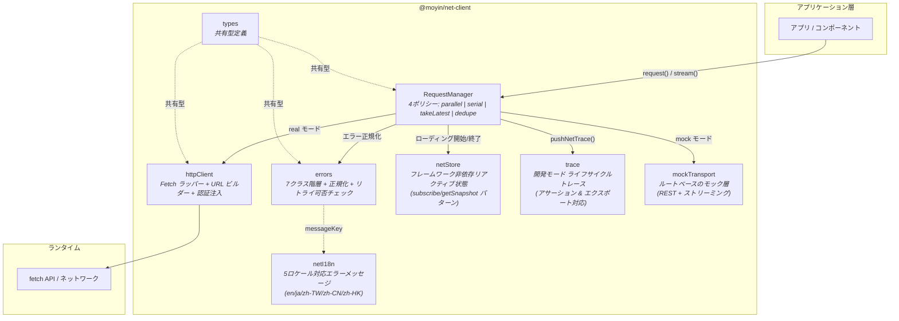

<p align="center">
  <strong>@moyin/net-client</strong><br/>
  フレームワーク非依存の TypeScript HTTP クライアント ―― リクエスト重複排除・同時実行制御・リトライ戦略・ストリーミングを一体化
</p>

<p align="center">
  <a href="https://github.com/AtsushiHarimoto/Moyin-Factory"></a>
  
  
  
  
</p>

<p align="center">
  <a href="../README.md">English</a> | 日本語 | <a href="README.zh-TW.md">繁體中文</a>
</p>

---

## なぜこのライブラリが必要か

多くの HTTP クライアントは「正常系」しか想定していません。しかし実際のプロダクションアプリケーションでは、次のような問題が日常的に発生します。

- **重複リクエスト** ―― ダブルクリックやサジェスト検索による連続発火
- **古いレスポンスの競合** ―― 後発リクエストが完了した後に到着する旧レスポンス
- **不安定なネットワーク** ―― 指数バックオフによるインテリジェントなリトライが不可欠
- **ローディング状態の分散** ―― コンポーネントごとに散らばる状態管理ロジック

`@moyin/net-client` はこれらすべてをトランスポート層で解決します。**4 つの同時実行ポリシー**、**構造化されたエラー階層**、**フレームワーク非依存のリアクティブストア** により、UI 層をクリーンに保ちます。

---

## アーキテクチャ



### モジュール責務

| モジュール | 行数 | 責務 |
|-----------|-----:|------|
| `requestManager.ts` | 611 | コアオーケストレーター ―― インフライト追跡・4 ポリシー・リトライループ・ストリーミング・キャンセル |
| `httpClient.ts` | 198 | タイムアウト・URL 解決・認証トークン注入・便利メソッド (`get`/`post`/`put`/`patch`/`del`) |
| `errors.ts` | 179 | 7 つの型付きエラークラス + 正規化関数 + リトライ可否チェック |
| `netStore.ts` | 154 | `subscribe`/`getSnapshot` パターンによるフレームワーク非依存リアクティブストア |
| `trace.ts` | 130 | リングバッファによるリクエストライフサイクルトレース・サマリーエクスポート・アサーション |
| `netI18n.ts` | 77 | 5 ロケール対応ローカライズエラーメッセージ |
| `mockTransport.ts` | 82 | REST およびストリーミング対応のルートベースモックトランスポート |
| `types.ts` | 226 | モジュールシステム全体の共有型定義 |

---

## 主要な技術的意思決定

### 1. 4 つの同時実行ポリシー

すべてのリクエストは `policy` を宣言し、同一 `requestKey` を持つ並行リクエストの振る舞いを制御します。

| ポリシー | 動作 | ユースケース |
|----------|------|-------------|
| `parallel` | すべてのリクエストが独立して実行 | バッチ操作・独立リソース取得 |
| `takeLatest` | 新リクエストが前のリクエストを自動キャンセル | インクリメンタル検索・フィルター変更 |
| `dedupe` | 後続呼び出しが既存インフライトの Promise を共有 | コンポーネントマウント・キャッシュウォームアップ |
| `serial` | リクエストがキューに入り順次実行 | ミューテーション順序保証・フォーム送信 |

```typescript
// インクリメンタル検索: 最後のキーストロークのリクエストのみが生き残る
const { promise } = manager.request({
  method: 'GET',
  url: '/search',
  params: { q: query },
  policy: 'takeLatest',
  requestKey: 'search-main',
})
```

### 2. 指数バックオフリトライ

特定の HTTP ステータスコードを対象とした、設定可能な指数バックオフリトライ:

```typescript
const { promise } = manager.request({
  method: 'POST',
  url: '/api/submit',
  data: payload,
  retry: {
    maxRetries: 3,
    baseDelayMs: 300,
    backoffFactor: 2,          // 300ms -> 600ms -> 1200ms
    retryOnStatuses: [429, 500, 502, 503, 504],
  },
})
```

リトライはキャンセルを尊重します。バックオフ待機中にキャンセルされた場合、即座に終了してリソースを無駄にしません。

### 3. 構造化されたエラー階層

すべてのエラーは型付きの `NetError` サブクラスであり、意味的なプロパティを持ちます:

```
NetError (基底クラス)
  ├── NetHttpError        { httpStatus: number }
  ├── NetTimeoutError     { isTimeout: true }
  ├── NetOfflineError     { isOffline: true }
  ├── NetCanceledError    { isCanceled: true, cancelReason }
  ├── NetStaleDiscardedError  { isStale: true }
  ├── NetLateDiscardedError
  └── NetUnknownError
```

`normalizeToNetError()` 関数は生の例外（DOMException AbortError、fetch 失敗による TypeError）を型付き階層に変換します。エラーハンドリングを常に一貫させます。

### 4. フレームワーク非依存のリアクティブストア

`netStore` モジュールは React 18 の `useSyncExternalStore` と同一の `subscribe`/`getSnapshot` パターンを採用しています:

- **React**: `useSyncExternalStore(subscribe, getSnapshot)` に直接接続
- **Vue**: `watchEffect` または computed でラップ
- **Vanilla JS**: `subscribe()` を呼び出し `getSnapshot()` で読み取り

追跡される状態にはグローバルローディングカウント・スコープ別ローディング・オフライン検出・ネットワーク不安定性（スライディングウィンドウ障害率分析）が含まれます。

### 5. 開発モードリクエストトレース

開発モードでは、すべてのリクエストライフサイクルイベントが完全なメタデータとともにリングバッファに記録されます:

```typescript
const payload = exportNetTracePayload({ appVersion: '1.0.0' })
// { traceMeta, events: [...], summary: { totals, assertions } }
```

トレースシステムには組み込みの **アサーションチェック** が含まれます。例えば、すべての `late_response_discarded` イベントに対応する `request_end` イベントが正しい最終状態で存在することを検証します。

---

## クイックスタート

### インストール

これは **ソースのみの TypeScript ライブラリ** です。ビルドステップなしで `.ts` ソースファイルを直接出荷します。ホストプロジェクト自身の TypeScript/バンドラーツールチェーンで消費するように設計されています。

```bash
npm install @moyin/net-client
```

### 設定

```typescript
import { configure, RequestManager } from '@moyin/net-client'

// グローバル HTTP 設定
configure({
  baseUrl: 'https://api.example.com',
  defaultTimeoutMs: 10_000,
  defaultHeaders: { 'X-App': 'my-app' },
  getAuthToken: () => localStorage.getItem('token'),
})

// RequestManager インスタンスの作成
const manager = new RequestManager({ mode: 'real', isDev: true })
```

### 基本リクエスト

```typescript
const { promise, cancel } = manager.request<{ id: string; name: string }>({
  method: 'GET',
  url: '/users/123',
})

const result = await promise

if (result.ok) {
  console.log(result.data)        // { id: '123', name: '...' }
  console.log(result.durationMs)  // 142
} else {
  console.error(result.error)      // NetError サブクラス
  console.error(result.finalState) // 'error' | 'canceled' | 'stale_discarded' | ...
}
```

### ストリーミング (SSE / LLM レスポンス)

```typescript
const handle = manager.stream({
  method: 'POST',
  url: '/chat/completions',
  data: { prompt: 'こんにちは' },
  requestKey: 'chat',
  policy: 'takeLatest',
})

handle.onChunk((chunk) => {
  process.stdout.write(chunk.text)
})

handle.onDone(() => {
  console.log('\nストリーム完了')
})

handle.onError((err) => {
  console.error('ストリームエラー:', err.code)
})
```

### 軽量 HTTP クライアント (マネージャーなし)

同時実行制御が不要な簡単なケース向け:

```typescript
import { get, post } from '@moyin/net-client'

const { data } = await get<User[]>('/users', { page: '1' })
await post('/users', { name: 'Alice' })
```

### 開発用モックモード

```typescript
import { registerMockRoute, RequestManager } from '@moyin/net-client'

registerMockRoute({
  method: 'GET',
  path: '/users/123',
  handler: () => ({ id: '123', name: 'モックユーザー' }),
  delay: 200,
})

const manager = new RequestManager({ mode: 'mock' })
const { promise } = manager.request({ method: 'GET', url: '/users/123' })
const result = await promise  // { ok: true, data: { id: '123', name: 'モックユーザー' } }
```

### リアクティブストア連携

```typescript
import { subscribe, getSnapshot } from '@moyin/net-client'

// React
import { useSyncExternalStore } from 'react'
function useNetStore() {
  return useSyncExternalStore(subscribe, getSnapshot)
}

// Vue
import { ref, watchEffect } from 'vue'
const netState = ref(getSnapshot())
subscribe(() => { netState.value = getSnapshot() })
```

### ローカライズされたエラーメッセージ

```typescript
import { resolveNetMessage } from '@moyin/net-client'

// result.error.messageKey = 'net.timeout'
const msg = resolveNetMessage(result.error?.messageKey, 'ja')
// => 'リクエストがタイムアウトしました。しばらくしてから再試行してください'
```

---

## テスト

```bash
npm test           # 全テスト実行
npm run test:watch # ウォッチモード
npm run typecheck  # TypeScript 型チェック
```

8 つのテストスイートが全モジュールをカバーしています:

| テストファイル | カバレッジ |
|--------------|-----------|
| `requestManager.spec.ts` | コアポリシー・キャンセル・オフライン検出 |
| `requestManager-dedupe.spec.ts` | 重複排除のエッジケース |
| `requestManager-retry.spec.ts` | バックオフリトライ・リトライ可能ステータスコード |
| `errors.spec.ts` | エラー階層・正規化・リトライ可否 |
| `netStore.spec.ts` | リアクティブストア・ローディング追跡・不安定性検出 |
| `trace.spec.ts` | トレースバッファ・エクスポート・アサーション |
| `netI18n.spec.ts` | 多ロケールメッセージ解決 |
| `mockTransport.spec.ts` | モックルート登録と実行 |

---

## API リファレンス

### RequestManager

| メソッド | シグネチャ | 説明 |
|---------|-----------|------|
| `request<T>()` | `(opts: NetRequest) => { requestId, requestKey, promise, cancel }` | ポリシー/リトライ対応の REST リクエスト実行 |
| `stream()` | `(opts: NetRequest) => NetStreamHandle` | チャンクコールバック付きストリーミングリクエスト実行 |
| `cancel()` | `(target: string) => boolean` | requestId または requestKey によるキャンセル |
| `dispose()` | `() => void` | 全インフライトリクエストのキャンセルとイベントリスナーのクリーンアップ |

### NetRequest オプション

| オプション | 型 | デフォルト | 説明 |
|-----------|-----|-----------|------|
| `method` | `HttpMethod` | -- | `GET` / `POST` / `PUT` / `PATCH` / `DELETE` |
| `url` | `string` | -- | リクエスト URL (相対または絶対) |
| `policy` | `NetPolicy` | `'takeLatest'` | 同時実行ポリシー |
| `requestKey` | `string` | 自動生成 | ポリシーグルーピング用キー |
| `retry` | `NetRetryOptions` | `{ maxRetries: 0 }` | リトライ設定 |
| `timeoutMs` | `number` | `15000` | リクエストタイムアウト |
| `mock` | `boolean` | マネージャーモード依存 | モック/実モードの強制指定 |
| `silent` | `boolean` | `false` | ローディング状態追跡のスキップ |
| `trackLoading` | `'global' \| 'scope' \| 'none'` | `'global'` | ローディング状態スコープ |

### NetResult\<T\>

| フィールド | 型 | 説明 |
|-----------|-----|------|
| `ok` | `boolean` | リクエストが成功したかどうか |
| `data` | `T \| undefined` | レスポンスデータ |
| `error` | `NetError \| undefined` | 失敗時の型付きエラー |
| `finalState` | `NetFinalState` | 終端状態: `ok` / `error` / `canceled` / `stale_discarded` / `late_discarded` |
| `durationMs` | `number` | リトライを含む合計リクエスト時間 |
| `retryCount` | `number` | 試みられたリトライ回数 |
| `deduped` | `boolean \| undefined` | 重複排除による共有結果かどうか |

---

## Moyin エコシステムの一部

このモジュールは [**Moyin Factory**](https://github.com/AtsushiHarimoto/Moyin-Factory) の一部です ―― プロダクショングレードの TypeScript アプリケーション構築のためのモジュラーアーキテクチャ。

ゼロランタイム依存のスタンドアロン・ソースオンリー TypeScript ライブラリです。

---

## ライセンス

[CC BY-NC 4.0](../LICENSE) ―― Creative Commons Attribution-NonCommercial 4.0 International
