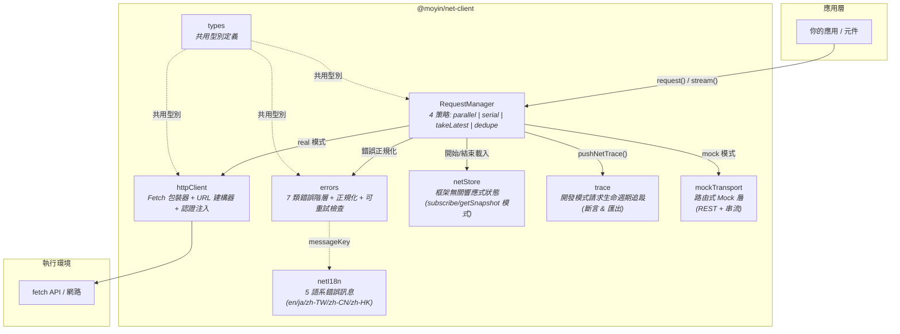

<p align="center">
  <strong>@moyin/net-client</strong><br/>
  框架無關的 TypeScript HTTP 用戶端 ―― 請求去重、並行策略、重試機制、串流，一套搞定
</p>

<p align="center">
  <a href="https://github.com/AtsushiHarimoto/Moyin-Factory"></a>
  
  
  
  
</p>

<p align="center">
  <a href="../README.md">English</a> | <a href="README.ja.md">日本語</a> | 繁體中文
</p>

---

## 為什麼需要這個函式庫？

大多數 HTTP 用戶端只處理「一切順利」的情境。但真實世界的應用程式每天都面臨：

- **重複請求** ―― 雙擊或即時搜尋輸入觸發的大量重複呼叫
- **過期回應競爭** ―― 新請求完成後，舊請求的回應才遲遲抵達
- **不穩定的網路** ―― 需要帶指數退避的智慧重試機制
- **載入狀態蔓延** ―― 分散在各元件中、難以統一管理的 loading 邏輯

`@moyin/net-client` 在傳輸層一次解決上述所有問題。透過 **四種並行策略**、**結構化錯誤階層** 以及 **框架無關的響應式 Store**，讓 UI 層保持乾淨清晰。

---

## 架構



### 模組職責

| 模組 | 行數 | 職責 |
|------|-----:|------|
| `requestManager.ts` | 611 | 核心協調器 ―― 飛行中追蹤、4 種並行策略、重試迴圈、串流、取消 |
| `httpClient.ts` | 198 | Fetch 包裝器，含逾時、URL 解析、認證 Token 注入、便利方法 (`get`/`post`/`put`/`patch`/`del`) |
| `errors.ts` | 179 | 7 個具型錯誤類別 + 正規化函式 + 可重試性檢查 |
| `netStore.ts` | 154 | 以 `subscribe`/`getSnapshot` 模式實作的框架無關響應式 Store |
| `trace.ts` | 130 | 環形緩衝區請求生命週期追蹤、摘要匯出、斷言檢查 |
| `netI18n.ts` | 77 | 5 語系本地化錯誤訊息 |
| `mockTransport.ts` | 82 | 支援 REST 與串流的路由式 Mock 傳輸層 |
| `types.ts` | 226 | 整個模組系統的共用型別定義 |

---

## 關鍵技術決策

### 1. 四種並行策略

每個請求宣告一個 `policy`，控制具有相同 `requestKey` 的並行請求行為：

| 策略 | 行為 | 使用場景 |
|------|------|---------|
| `parallel` | 所有請求獨立執行 | 批次操作、獨立資源請求 |
| `takeLatest` | 新請求自動取消前一個 | 即時搜尋、篩選條件變更 |
| `dedupe` | 後續呼叫共享現有飛行中的 Promise | 元件掛載、快取預熱 |
| `serial` | 請求排隊逐一執行 | 有序變更操作、表單送出 |

```typescript
// 即時搜尋：只有最後一次按鍵觸發的請求存活
const { promise } = manager.request({
  method: 'GET',
  url: '/search',
  params: { q: query },
  policy: 'takeLatest',
  requestKey: 'search-main',
})
```

### 2. 指數退避重試

可設定的指數退避重試，針對特定 HTTP 狀態碼：

```typescript
const { promise } = manager.request({
  method: 'POST',
  url: '/api/submit',
  data: payload,
  retry: {
    maxRetries: 3,
    baseDelayMs: 300,
    backoffFactor: 2,          // 300ms -> 600ms -> 1200ms
    retryOnStatuses: [429, 500, 502, 503, 504],
  },
})
```

重試尊重取消操作 ―― 若請求在退避等待中被取消，會立即結束，不浪費任何資源。

### 3. 結構化錯誤階層

每個錯誤都是具型的 `NetError` 子類別，帶有語意化屬性：

```
NetError (基底類別)
  ├── NetHttpError        { httpStatus: number }
  ├── NetTimeoutError     { isTimeout: true }
  ├── NetOfflineError     { isOffline: true }
  ├── NetCanceledError    { isCanceled: true, cancelReason }
  ├── NetStaleDiscardedError  { isStale: true }
  ├── NetLateDiscardedError
  └── NetUnknownError
```

`normalizeToNetError()` 函式將原始例外（DOMException AbortError、fetch 失敗的 TypeError）轉換為具型階層，讓錯誤處理始終一致。

### 4. 框架無關的響應式 Store

`netStore` 模組使用與 React 18 `useSyncExternalStore` 合約完全相同的 `subscribe`/`getSnapshot` 模式：

- **React**：直接接入 `useSyncExternalStore(subscribe, getSnapshot)`
- **Vue**：以 `watchEffect` 或 computed 包裝
- **Vanilla JS**：呼叫 `subscribe()` 並讀取 `getSnapshot()`

追蹤狀態包含全域載入計數、分範圍載入、離線偵測，以及網路不穩定性（滑動視窗失敗率分析）。

### 5. 開發模式請求追蹤

在開發模式下，每個請求生命週期事件都會帶完整元資料記錄進環形緩衝區：

```typescript
const payload = exportNetTracePayload({ appVersion: '1.0.0' })
// { traceMeta, events: [...], summary: { totals, assertions } }
```

追蹤系統內建 **斷言檢查** ―― 例如驗證每個 `late_response_discarded` 事件都有對應的 `request_end`，且終端狀態正確。

---

## 快速開始

### 安裝

這是一個 **僅含原始碼的 TypeScript 函式庫** ―― 直接提供 `.ts` 原始檔，無需建構步驟。設計為由宿主專案自身的 TypeScript/打包工具鏈消費。

```bash
npm install @moyin/net-client
```

### 設定

```typescript
import { configure, RequestManager } from '@moyin/net-client'

// 全域 HTTP 設定
configure({
  baseUrl: 'https://api.example.com',
  defaultTimeoutMs: 10_000,
  defaultHeaders: { 'X-App': 'my-app' },
  getAuthToken: () => localStorage.getItem('token'),
})

// 建立 RequestManager 實例
const manager = new RequestManager({ mode: 'real', isDev: true })
```

### 基本請求

```typescript
const { promise, cancel } = manager.request<{ id: string; name: string }>({
  method: 'GET',
  url: '/users/123',
})

const result = await promise

if (result.ok) {
  console.log(result.data)        // { id: '123', name: '...' }
  console.log(result.durationMs)  // 142
} else {
  console.error(result.error)      // NetError 子類別
  console.error(result.finalState) // 'error' | 'canceled' | 'stale_discarded' | ...
}
```

### 串流 (SSE / LLM 回應)

```typescript
const handle = manager.stream({
  method: 'POST',
  url: '/chat/completions',
  data: { prompt: '你好' },
  requestKey: 'chat',
  policy: 'takeLatest',
})

handle.onChunk((chunk) => {
  process.stdout.write(chunk.text)
})

handle.onDone(() => {
  console.log('\n串流完成')
})

handle.onError((err) => {
  console.error('串流錯誤:', err.code)
})
```

### 輕量 HTTP 用戶端（無 Manager）

適用於不需要並行控制的簡單場景：

```typescript
import { get, post } from '@moyin/net-client'

const { data } = await get<User[]>('/users', { page: '1' })
await post('/users', { name: 'Alice' })
```

### 開發用 Mock 模式

```typescript
import { registerMockRoute, RequestManager } from '@moyin/net-client'

registerMockRoute({
  method: 'GET',
  path: '/users/123',
  handler: () => ({ id: '123', name: 'Mock 使用者' }),
  delay: 200,
})

const manager = new RequestManager({ mode: 'mock' })
const { promise } = manager.request({ method: 'GET', url: '/users/123' })
const result = await promise  // { ok: true, data: { id: '123', name: 'Mock 使用者' } }
```

### 響應式 Store 整合

```typescript
import { subscribe, getSnapshot } from '@moyin/net-client'

// React
import { useSyncExternalStore } from 'react'
function useNetStore() {
  return useSyncExternalStore(subscribe, getSnapshot)
}

// Vue
import { ref, watchEffect } from 'vue'
const netState = ref(getSnapshot())
subscribe(() => { netState.value = getSnapshot() })
```

### 本地化錯誤訊息

```typescript
import { resolveNetMessage } from '@moyin/net-client'

// result.error.messageKey = 'net.timeout'
const msg = resolveNetMessage(result.error?.messageKey, 'zh-TW')
// => '網絡超時，請稍後再試'
```

---

## 測試

```bash
npm test           # 執行所有測試
npm run test:watch # 監聽模式
npm run typecheck  # TypeScript 型別檢查
```

8 個測試套件涵蓋所有模組：

| 測試檔案 | 涵蓋範圍 |
|---------|---------|
| `requestManager.spec.ts` | 核心策略、取消、離線偵測 |
| `requestManager-dedupe.spec.ts` | 去重邊界情況 |
| `requestManager-retry.spec.ts` | 退避重試、可重試狀態碼 |
| `errors.spec.ts` | 錯誤階層、正規化、可重試性 |
| `netStore.spec.ts` | 響應式 Store、載入追蹤、不穩定性偵測 |
| `trace.spec.ts` | 追蹤緩衝區、匯出、斷言 |
| `netI18n.spec.ts` | 多語系訊息解析 |
| `mockTransport.spec.ts` | Mock 路由註冊與執行 |

---

## API 參考

### RequestManager

| 方法 | 簽名 | 說明 |
|------|------|------|
| `request<T>()` | `(opts: NetRequest) => { requestId, requestKey, promise, cancel }` | 執行支援策略/重試的 REST 請求 |
| `stream()` | `(opts: NetRequest) => NetStreamHandle` | 執行帶 chunk 回呼的串流請求 |
| `cancel()` | `(target: string) => boolean` | 以 requestId 或 requestKey 取消 |
| `dispose()` | `() => void` | 取消所有飛行中請求並清理事件監聽器 |

### NetRequest 選項

| 選項 | 型別 | 預設值 | 說明 |
|------|------|--------|------|
| `method` | `HttpMethod` | -- | `GET` / `POST` / `PUT` / `PATCH` / `DELETE` |
| `url` | `string` | -- | 請求 URL（相對或絕對） |
| `policy` | `NetPolicy` | `'takeLatest'` | 並行策略 |
| `requestKey` | `string` | 自動產生 | 策略分組用的鍵值 |
| `retry` | `NetRetryOptions` | `{ maxRetries: 0 }` | 重試設定 |
| `timeoutMs` | `number` | `15000` | 請求逾時時間 |
| `mock` | `boolean` | 依 Manager 模式 | 強制指定 Mock/真實模式 |
| `silent` | `boolean` | `false` | 略過載入狀態追蹤 |
| `trackLoading` | `'global' \| 'scope' \| 'none'` | `'global'` | 載入狀態範圍 |

### NetResult\<T\>

| 欄位 | 型別 | 說明 |
|------|------|------|
| `ok` | `boolean` | 請求是否成功 |
| `data` | `T \| undefined` | 回應資料 |
| `error` | `NetError \| undefined` | 失敗時的具型錯誤 |
| `finalState` | `NetFinalState` | 終端狀態：`ok` / `error` / `canceled` / `stale_discarded` / `late_discarded` |
| `durationMs` | `number` | 含重試的總請求時間 |
| `retryCount` | `number` | 實際重試次數 |
| `deduped` | `boolean \| undefined` | 是否為去重共享結果 |

---

## Moyin 生態系成員

本模組是 [**Moyin Factory**](https://github.com/AtsushiHarimoto/Moyin-Factory) 的一部分 ―― 用於構建生產級 TypeScript 應用程式的模組化架構。

零執行時期依賴的獨立、僅含原始碼 TypeScript 函式庫。

---

## 授權

[CC BY-NC 4.0](../LICENSE) ―― Creative Commons 姓名標示-非商業性 4.0 國際授權
